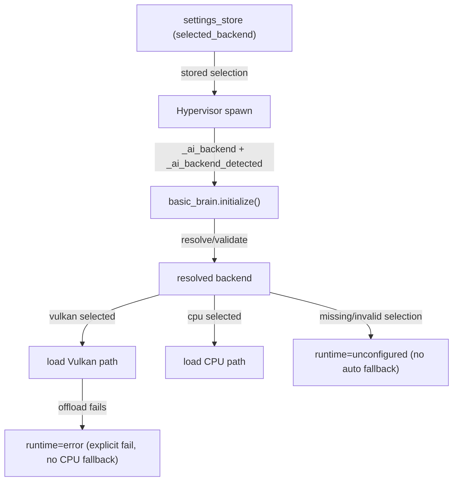

# Local Brain (`basic_brain`) — Local LLM Engine

## Purpose

The Basic Brain is the core inference module. It loads `.gguf` model files into
system RAM/VRAM via `llama-cpp-python` and generates text completions.  It
does not execute tools directly; it decides tool calls when schemas are provided
in `CHAT_REQUEST`, and streams generated tokens/results downstream.

## Process Model

**Isolated** (`PROCESS_ISOLATION = True`) — runs in a dedicated child process
managed by the Hypervisor. Payloads cross the process boundary via
`ProcessTransport` (JSON-serialised Pydantic models over `multiprocessing.Pipe`).
The Hypervisor can restart this module independently without affecting the rest
of the stack.

**Rationale:** llama.cpp is a native C library bound through llama-cpp-python.
Long-running GPU inference and potential segfaults in native code make process
isolation essential — a crash here must not bring down the core event loop or
other modules.

## Runtime/Setup Notes

- The module is loaded in an isolated worker process. CUDA runtime library
  search paths must therefore be configured inside the worker before importing
  `llama_cpp`.
- On Windows, Miniloader prepends discovered CUDA/llama library directories to
  `PATH` (and also calls `os.add_dll_directory`) so `llama.dll` transitive
  dependencies are resolvable in Python 3.11+.
- CUDA runtime libraries are discovered in this order:
  1. app-local `cuda_runtime/` directory
  2. CUDA Toolkit installation
  3. NVIDIA redistributable pip packages
     (`nvidia-cuda-runtime-cu12`, `nvidia-cublas-cu12`)
- On Linux, runtime library directories are prepended to `LD_LIBRARY_PATH`.
- The Local AI setup flow is now split:
  - **LLM Inference Setup** installs `llama-cpp-python` + CUDA/telemetry deps.
  - **RAG Embeddings Setup** installs embeddings/vector-store deps separately.
- Model-format compatibility depends on the installed `llama-cpp-python`
  version/build. A model can fail to load even when CUDA is healthy if that
  model architecture is unsupported by the installed backend.
- **Backend policy: no silent fallbacks.** If the user selects Vulkan and
  Vulkan/GPU offload verification fails, Basic Brain reports an explicit error
  and refuses to run in CPU fallback mode. The user must intentionally switch
  the backend in Settings.

## Backend Selection and Ownership (Apr 2026)

Backend selection is now explicitly user-owned and enforced by `basic_brain`.
The Hypervisor no longer silently substitutes a detected backend when user
selection is missing.

### Rules

- Valid user choices are only `vulkan` and `cpu`.
- Worker params receive both values:
  - `_ai_backend` (stored user selection, may be empty)
  - `_ai_backend_detected` (hardware hint for diagnostics/recommendation)
- `basic_brain` resolves backend at startup:
  - if user selection is valid, it is honored
  - if selection is missing, module reports `unconfigured` and does not
    auto-select
  - if selection is invalid, module reports `unconfigured` with explicit
    guidance
- If user selected Vulkan and GPU offload verification fails, model load aborts
  with an error. No CPU fallback is applied.

### Architecture map



## Validated Compatibility (Mar 30, 2026)

The standalone battery in `scripts/model_test_suite.py` was run with:

- Backend: Vulkan (`gpu_layers=-1`) on AMD RX 7900 XTX
- Context length: `2048`
- Output tokens per test: `50`
- JSON report: `scripts/model_test_results_with_image.json`

Result summary: **13/13 models passed** for model load + raw completion + chat
completion in this environment.

### Tier 1 (Core, < 9B) — passed

- Llama 3.2 1B Instruct (`Q8_0`)
- Llama 3.2 1B Instruct (`F16`)
- Llama 3.2 3B Instruct (`Q4_K_M`)
- Gemma 3 1B IT (`Q8_0`)
- Gemma 3 4B IT (`Q4_K_M`)
- Qwen3 4B (`Q4_K_M`)
- Qwen2.5 7B Instruct (`Q4_K_M`, sharded GGUF)
- Mistral 7B Instruct v0.3 (`Q4_K_M`)

### Tier 2 (Extended, 9B-27B) — passed

- Qwen3.5 9B (`Q4_K_M`)
- Gemma 3 12B IT (`Q4_K_M`)
- Llama 3.1 8B Instruct (`Q4_K_M`)
- Gemma 3 27B IT (`Q4_K_M`)

### Multimodal image-path validation

Image tests were executed and passed for multimodal models:

- Gemma 3 1B IT
- Gemma 3 4B IT
- Qwen3.5 9B
- Gemma 3 12B IT
- Gemma 3 27B IT

Image tests are skipped for text-only models by design.

### Notes on current runtime pin

- Current local pin is `llama.cpp b8514` (JamePeng `0.3.33`).
- Test run reported latest upstream as `b8583`; newer architectures may still
  require a runtime pin bump in `core/llama_runtime.py`.

### Sharded GGUF note

Some repositories publish models as multiple GGUF shards, for example:
`...-00001-of-00002.gguf`, `...-00002-of-00002.gguf`.

- Set `model_path` to the **first shard** (`...-00001-of-...`).
- Keep all shards in the same directory.
- llama.cpp resolves the remaining shards automatically at load time.

### Known fork bug: `LlamaBatch.add_sequence()` signature mismatch

The JamePeng `llama-cpp-python` fork (used for Vulkan support) changed
`LlamaBatch.add_sequence()` to require four keyword arguments (`token_array`,
`pos_array`, `seq_ids`, `logits_array`), but did not update the high-level
`Llama.embed()` method, which still passes three positional args. This breaks
`embed()` and `create_embedding()` with a `TypeError`.

**basic_brain is not affected** — the main text-generation path (`eval()` at
`llama.py` line 886) already uses the correct keyword form of
`add_sequence()`. Only the embedding codepath is broken.

**rag_engine is affected** — see `modules/rag_engine/MODULE.md` and
`docs/architecture.md` for the full bug description and the `_embed_direct()`
workaround. If the fork publishes a fixed wheel, the workaround can be
removed.

## Parameters

| Parameter        | Type        | Default  | Description                                                                 |
|------------------|-------------|----------|-----------------------------------------------------------------------------|
| `model_path`     | string      | `""`     | Absolute path to a `.gguf` model file                                       |
| `gpu_layers`     | int         | `0`      | Number of layers to offload to the GPU (`-1` = all)                         |
| `ctx_length`     | int         | `4096`   | Context window size in tokens                                               |
| `temperature`    | float       | `0.7`    | Sampling temperature for generation                                         |
| `n_batch`        | int         | `512`    | Batch size for prompt processing                                            |
| `cpu_threads`    | int         | auto     | Number of CPU threads (defaults to physical core count)                      |
| `top_p`          | float       | `0.95`   | Nucleus sampling threshold                                                  |
| `top_k`          | int         | `40`     | Top-K sampling cutoff                                                       |
| `repeat_penalty` | float       | `1.10`   | Repetition penalty                                                          |
| `seed`           | int         | `-1`     | RNG seed (`-1` = random)                                                    |
| `vulkan_device`  | int         | `0`      | Vulkan device index for multi-GPU systems                                   |
| `flash_attn`     | `auto`/bool | `"auto"` | Flash Attention toggle. `auto` resolves at load time (OFF for NVIDIA Vulkan, ON for AMD/Intel Vulkan). Visible in advanced UI mode only; simple mode always uses `auto`. |
| `cache_type_k`   | string      | `"f16"`  | KV cache key quantization (auto-set to `q8_0` for Vulkan)                   |
| `cache_type_v`   | string      | `"f16"`  | KV cache value quantization (auto-set to `q8_0` for Vulkan)                 |

## Ports

| Port Name      | Direction | Mode    | Accepted Signals                                   | Max Connections |
|----------------|-----------|---------|-----------------------------------------------------|-----------------|
| `AI_OUT` (runtime: `BRAIN_OUT`) | OUT | CHANNEL | `CHAT_REQUEST`, `BRAIN_STREAM_PAYLOAD` | 1 |

## Data Flow

```
[gpt_terminal / discord_terminal]
          │
          ▼
 [gpt_server HTTP /v1/chat/completions]
          │  (CHAT_REQUEST on BRAIN_IN channel)
          ▼
 [basic_brain BRAIN_OUT channel]
          │  (BRAIN_STREAM_PAYLOAD)
          ▼
 [gpt_server] ──▶ HTTP/SSE response
```

**Tool-calling path**

- The client (`gpt_terminal` / `discord_terminal` directly, or **`agent_engine`**
  on their behalf) sends `tools` / `tool_choice` inside `CHAT_REQUEST`.
- `basic_brain` passes these to llama.cpp and may emit `tool_calls` in final
  `BRAIN_STREAM_PAYLOAD`.
- The orchestrator executes tools (MCP / `tool_bus`, etc.) and sends the next
  round back to the model over HTTP (`gpt_server`).

### Tool use with chat templates (GGUF)

Some models use Jinja chat templates that do not expose OpenAI-style `tools` in
the prompt. When `tools` are present on the request, `basic_brain`:

- Injects a **system-level tool description** built by `_build_tool_prompt()`:
  lists each tool’s signature, instructs the model to call tools **only** when
  external data is required (not for greetings or chit-chat), to emit calls as
  `<tool_call>` JSON blocks, and to **summarize** tool output for the user
  instead of repeating the same tool with the same arguments.
- Optionally **flattens** prior turns with `_flatten_tool_messages()`:
  assistant messages that contain `tool_calls` become plain assistant text with
  embedded `<tool_call>` blocks; `role: "tool"` messages become synthetic
  `role: "user"` text prefixed with an explicit instruction that the tool
  already returned data and the model should summarize it and avoid redundant
  tool calls unless the user asks for something new.

Together with `agent_engine`’s unwrapped tool `content` and duplicate-call
guard, this reduces spurious repeat tool calls and “max tool rounds exceeded”
failures.

---

## JSON Payload Examples

### CHANNEL: Receiving CHAT_REQUEST on `[AI_OUT]` (runtime: `[BRAIN_OUT]`)

Inbound from `gpt_server` on the bidirectional channel. The request includes
messages and optional OpenAI-style tool schema fields.

```json
{
  "id": "pld_chat_001",
  "signal_type": "CHAT_REQUEST",
  "source_module": "gpt_server_01",
  "timestamp": "2026-04-08T11:49:50Z",
  "data": {
    "request_id": "req_abc123",
    "thread_id": "thread_main",
    "messages": [
      { "role": "system", "content": "You are helpful." },
      { "role": "user", "content": "Summarize the Q3 report." }
    ],
    "tools": [
      {
        "type": "function",
        "function": {
          "name": "search_documents",
          "description": "Search indexed documents",
          "parameters": {
            "type": "object",
            "properties": { "query": { "type": "string" } },
            "required": ["query"]
          }
        }
      }
    ],
    "tool_choice": "auto"
  }
}
```

### CHANNEL: Emitting BRAIN_STREAM_PAYLOAD on `[AI_OUT]` (runtime: `[BRAIN_OUT]`)

Streamed token batches to `gpt_server` with completion state.

```json
{
  "id": "pld_stream_001",
  "signal_type": "BRAIN_STREAM_PAYLOAD",
  "source_module": "basic_brain_01",
  "timestamp": "2026-04-08T11:49:51Z",
  "data": {
    "request_id": "req_abc123",
    "token": "Quarter 3 revenue increased by 14%.",
    "done": false
  }
}
```

Final payload includes usage and may include model-decided `tool_calls`:

```json
{
  "id": "pld_stream_002",
  "signal_type": "BRAIN_STREAM_PAYLOAD",
  "source_module": "basic_brain_01",
  "timestamp": "2026-04-08T11:49:53Z",
  "data": {
    "request_id": "req_abc123",
    "token": "",
    "done": true,
    "full_response": "",
    "prompt_tokens": 274,
    "completion_tokens": 0,
    "ttft_s": 0.31,
    "total_s": 0.48,
    "tool_calls": [
      {
        "id": "call_0",
        "type": "function",
        "function": {
          "name": "search_documents",
          "arguments": "{\"query\":\"Q3 revenue increase\"}"
        }
      }
    ]
  }
}
```

### Hypervisor Telemetry: MODEL_LOAD_PAYLOAD

Emitted during `initialize()` to report model loading progress. This payload
flows to the Hypervisor invisibly (not through a port wire).

```json
{
  "id": "pld_d9e0f1g2",
  "signal_type": "MODEL_LOAD_PAYLOAD",
  "source_module": "basic_brain_01",
  "timestamp": "2026-02-24T11:49:40Z",
  "data": {
    "model_name": "mistral-7b-instruct-v0.3.Q5_K_M.gguf",
    "status": "loading",
    "progress_percent": 64,
    "layers_offloaded_gpu": 28,
    "layers_total": 32,
    "estimated_vram_mb": 5800,
    "estimated_ram_mb": 1200
  }
}
```
